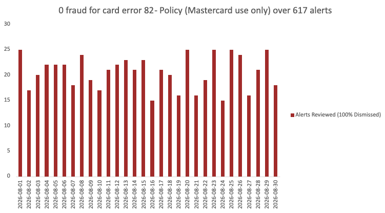

# portfolio-fraud-alert-project
This repo contains a data analytics project based on a fraud alert that I handled in my previous role.

The alert is for a card error that the team has been monitoring since before I joined. Over time, I realized that there was ZERO fraud discovered from this particular alert. However, it was hard to convince my team lead to drop this alert without proper data to back up my claim.

This project recreates that scenario to show how I'd make the case today. Using simulated data representing a month of alerts, I built an analysis to show that from 617 alerts reviewed, zero resulted in confirmed fraud. This is a strong enough case to justify dropping the alert and redirecting efforts elsewhere.

The XLSX file titled fraud_alert_portfolio contains all the data that was used in this project. The data here has been simulated using Claude - no real data was used.

The file titled fraud_alert_chart is the resulting visualization of the analysis.

